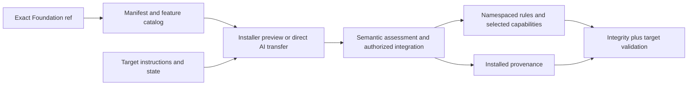
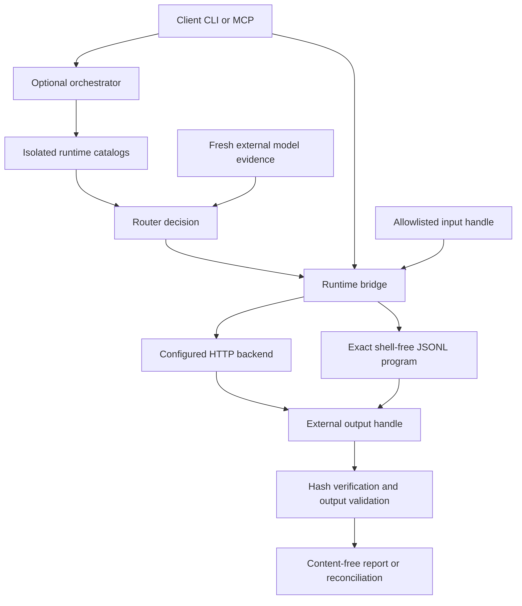
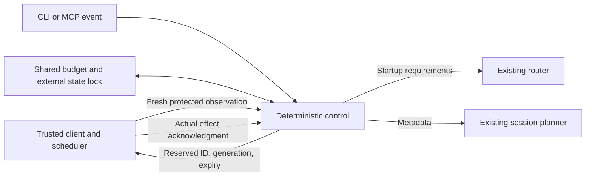

# Architecture Overview

Status: INFORMATIVE

The Foundation separates durable governance from optional execution. Its rules, schemas, installation model, and truthful manual fallbacks remain usable when Python, MCP, a model, a provider, a network, or every executable AI component is absent. The [user guide](../Guides/USER_GUIDE.md) supplies terms, adoption steps and a worked example; the [Foundation reference](../Standards/FOUNDATION_REFERENCE.md) links normative boundaries.

## Whole-framework components

| Component | Input → output | Responsibility and boundary |
| --- | --- | --- |
| Native discovery and governance | current task + client-discovered rules → authorized scoped work | Project authority, privacy and safe operations; discovery adapters import rather than duplicate rules |
| Transfer and upgrade | exact source manifest + target state → preview, assessment, installed receipt | Whitelist, compatible target governance, complete feature delta, portable hashes; no source-project state transfer |
| Project continuity | durable context/decisions/status → successor understanding | Repository facts survive a conversation; a compact handoff supplements them |
| Identity and registration | artifact creation/reservation → permanent UID/reference/relations | One authority per scope; optional clients or GitHub v2 object merging preserve IDs and generated views |
| Validation and repository recovery | claims/checks + evidence → scoped status and recovery obligations | Integrity/semantic/runtime separation; unavailable infrastructure never becomes passing validation |
| AI work stack | request + capability/runtime/model evidence → plan, invocation and report | Optional layers below, each preserving its narrower authority |
| Session lifecycle | counters + boundary + thresholds/client evidence → continue/checkpoint/rotate | Core schemas/policy, optional `ai-work` evaluator; actual successor creation is client-owned |
| Processing efficiency | current discovery/source/dependency binding + retained analysis/budget → reuse or bounded work | Core session-local helper/overhead assessment; optional persistent cache keeps exact invalidation semantics |

The [feature catalog](../../foundation/feature_catalog.json) defines the semantic inventory; the guide maps every feature to its explanation and authority. Model output, cache records, installation receipts and chats do not become project authority.

## Repository and transfer boundary

1. **Foundation source project** — its own README, license, development governance, registry/backlog, status, handover, decisions, quality evidence, tests, and tools.
2. **Transferable rule set** — the explicit `core`, adapter, and optional-capability whitelist in `foundation/manifest.json`. The manifest is also the single ruleset-version and portable source-hash authority.
3. **Transfer mechanisms** — direct semantic AI transfer and the deterministic installer consume the same manifest. The optional deterministic ZIP transports that exact manifest payload and minimum installer runtime for offline use; it does not create a third integration policy.

A target repository never receives Foundation-project state merely because a file exists in this repository. Its README, root license, architecture, context, decisions, status, backlog, validation system, identifier history, and Registration Authority remain project-owned. Generic reusable policies are mapped to `.ai/foundation/`, and selected capability code is installed only when explicitly requested.

The target root `AGENTS.md` is a discovery bridge. If absent, it can be created from the transfer template. If it differs, deterministic installation reports `MERGE_REQUIRED`; semantic transfer preserves project instructions and merges only the marked Foundation bridge. A clean installation records content-minimized provenance without claiming semantic or runtime validation.

Version mirrors follow the manifest; feature histories expose changed behavior to upgrades. Provenance identifies content and intentional overrides, while target validators establish correctness for their respective claims.

## AI work layers

| Layer | Contract/reference | Responsibility | Required? |
| --- | --- | --- | --- |
| Governance | `foundation-ai-work/v1`, policies and JSON Schemas | Describes work, data/risk, capabilities, effects, limits, validation and truthful terminal states | yes as readable rules when transferred |
| Planning | optional `ai-work` | Produces an `ExecutionPlan` or `GapReport`; never invokes a capability | no |
| Model decision | optional `model-router` | Preserves router v1 and adds v2 provider-fragment, boundary, evidence, resource and complete-chain routing | no |
| Runtime access | optional `ai-runtime-adapters` | Shared Ollama HTTP, OpenAI-compatible HTTP or explicit JSONL Stdio connections; legacy raw command path remains separate | no |
| Generic execution | optional `ai-executor` | Executes an exact AI-work plan with checkpoints, limits, approvals, idempotency and validation evidence | no |
| Host preparation | optional `ai-provisioning` | Diagnoses/inventories runtimes and performs only exact approved bounded provision plans; caches verified cost evidence | no |
| Client integration | optional `ai-client-integration` | Detects, plans, applies, verifies and rolls back client configuration; handles native or manual model dispatch evidence | no |
| Routed model facade and job control | optional `ai-orchestrator` | Composes the model pipeline; optional deterministic control reserves client actions against trusted observations, budgets and session lifecycle | no |

The router is intentionally decision-only. Runtime adapters may invoke a caller-selected model without the router. The generic executor runs a validated `ExecutionPlan`; the narrower orchestrator directly composes the model-routing pipeline. Manifest dependency declarations install companion code but never merge these authority boundaries or grant execution, network, credential, data-transfer, spend, publication, Git, push, or pull-request permission.

The other independent optional capabilities are `artifact-registration-clients`, `artifact-registry-github`, and `rule-context-cache`. `ai-executor` and `ai-provisioning` depend on `ai-work`; `ai-client-integration` and `ai-orchestrator` depend on `ai-work`, `model-router`, and `ai-runtime-adapters`. The other capabilities have no automatically selected capability dependencies. The manifest remains the dependency authority.

## Runtime data flow and extension points

The client-facing MCP server and child JSONL protocol are distinct interfaces. MCP calls the configured bridge; Stdio carries one `foundation-ai-adapter-jsonl/v1` request/response to a fresh explicitly configured child per operation. Arbitrary provider names are data; a reviewed wrapper can translate another API in any language. OpenAI-compatible HTTP identifies an interface format, not a manufacturer or universal compatibility promise.

The Stdio configuration variant is closed: exact argv with an absolute executable, explicit environment-name allowlist, optional absolute cwd, backend boundary, network/data authority, roots, timeouts/TTLs, credential reference and model-selection mode. HTTP variants preserve their earlier fields. Stdio passes no payload through argv and invokes no implicit shell. The legacy `CommandAdapter` keeps raw stdin/output and whole-argument substitutions.

Before invocation the bridge checks privacy, per-call remote authority and resolved handle roots. Control response/stderr are bounded, protocol/request identity is checked, and output hashes/counts are verified. `trust_model_metadata` defaults to false: only a reviewed target-trusted adapter can report observed backend identity. Process location and a copied request model do not establish it. Missing identity remains unattested even with the trust flag; actual/requested mismatches require strong fresh alias evidence in the orchestrator.

These checks constrain the bridge, not child OS privileges. Trusted adapters must report truthful boundaries and metadata; target isolation is necessary when ambient access is excessive. Timeout terminates the direct child; descendants, remote effects and backend cancellation require separate evidence.

## Data, evidence, and runtime state

Optional job control is a separate small path around the model pipeline. It uses the existing router only when startup is required and the existing session planner for handoff. It never invokes the model pipeline's execution step or runs evidence collectors. Public events cannot carry host observations or receipts.

The host checks before waking a model, enforces the referenced work/budget envelope and deduplicates delivery. Quiescence confirmation retires the predecessor before successor startup; a trusted actual-model receipt assigns the successor. Pending/unknown effects cannot be replayed. Unsupported capabilities remain manual. This requests client operations without implementing a daemon, vendor API, transport guarantee or provider spending limit. See the [control guide](../../foundation/capabilities/ai-orchestrator/AI_ORCHESTRATOR.md) and [through example](../Guides/USER_GUIDE.md#a-bounded-orchestrator-job-from-start-to-completion).

Control-plane contracts carry identifiers, hashes, classifications, limits, status, cost/resource totals and evidence metadata. Prompts, retrieved material and generated content travel through short-lived allowlisted handles or stdin/stdout protocols and are not persisted by default. Credentials, endpoint configuration, live inventories, model profiles, evidence-source definitions, checkpoints, reports, backups, downloads and host paths stay outside version control.

Discovery is not trust or authority. Catalog presence proves only an observation of availability. Automatic routing requires fresh source-backed capability/quality/context/cost evidence. A requested model is distinct from the actual model; `ATTESTED` requires matching response/execution metadata from a configured trusted issuer. Otherwise the system emits `REQUESTED_NOT_ATTESTED` or an expiring `MANUAL_DISPATCH_REQUIRED` handoff.

## Failure and validation behavior

Each provider, adapter, validator and evidence source has an independent health/expiry boundary. One unavailable catalog is excluded without invalidating healthy alternatives. No configuration yields `CONFIGURATION_REQUIRED`; missing route/evidence yields manual/unavailable handling. Pre-launch permission failures invoke no child. Timeout, malformed invocation response, child-reported invocation error or an interrupted checkpoint is ambiguous and stops for reconciliation rather than fallback/replay. Verified validation failures may follow the bounded fallback contract; unattested model identity preserves output for inspection and stops.

Session rotation checkpoints durable references at explicit boundaries and falls back to manual successor creation when client support is unproven. Changed discovery/rules/dependencies invalidate processing reuse; lost analysis requires reading again. Budget decisions require honest known/estimated/unknown accounting and do not enforce a provider quota. Required target gates survive efficiency optimizations.

Foundation validation proves `FOUNDATION_INTEGRITY` only. Target-specific semantics and real runtime behavior remain `PROJECT_SEMANTIC` and `RUNTIME_EMPIRICAL` responsibilities. Tool/vendor adapters remain thin discovery/import bridges; no subagent, web, shell, Git, memory, model-switching or cloud feature is assumed.
